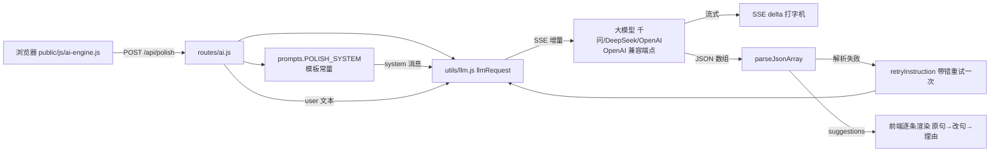
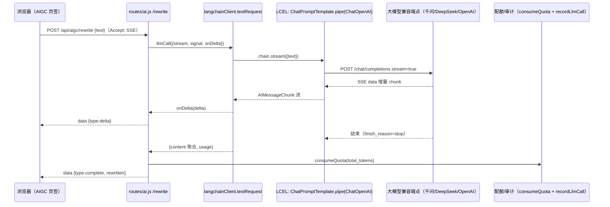
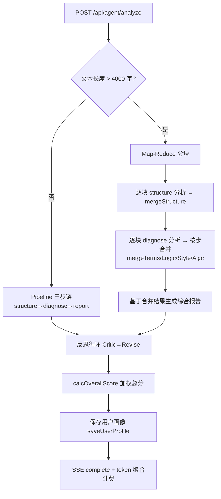

# 琢言（Zhuoyan）系统实现说明 —— 核心代码 · 流程图 · 伪代码

> 对应课程验收条目：**① 提示词模板使用 / ② LangChain 及 Chain 的使用 / ④ RAG 框架的部署或 Agent 应用开发（本系统实现的是"Agent 应用开发"分支）**，并附 **⑤+⑥ 典型产品项目全过程实现**。
> 全部代码引用自真实仓库（commit `b46c929`），行号以文件现状为准，可直接打开核对。

---

## 0. 覆盖度声明（为什么选这三项）

课程标准要求"至少包含五部分中的三项"。本报告覆盖：

| 维度 | 落地位置 | 形态 |
|---|---|---|
| ① 提示词模板使用 | `server/prompts.js` + `routes/ai.js` / `agents/fullPaperAgent.js` 引用侧 | **生产真实在用**，5 个路由 + Agent 步骤全部引用模板库，无内嵌 |
| ② LangChain 及 Chain | `server/utils/langchainClient.js`（官方 LangChain LCEL）+ `server/agents/chain.js`（自研 Pipeline） | **双档**：官方 `@langchain/openai` 真实驱动降 AI 改写路由；自研 Pipeline 真实驱动全文 Agent 多步编排 |
| ④ RAG 或 Agent 应用开发 | `server/agents/fullPaperAgent.js` + `routes/agent.js` | 选"Agent 应用开发"分支：任务规划 → 链式执行 → 反思修订 → 综合打分 → 长文 Map-Reduce，完整应用级实现 |
| ③ 向量数据库 | —— | **按需未做**（见 §6 口径）：四大功能不依赖外部知识检索；`utils/chunking.js` 切块 + better-sqlite3 抽象层已预留平滑迁移口 |

质量底线：ESLint 0 error、Jest **36/36**、GitHub Actions CI 常绿（`b46c929` success）。

---

## 1. ① 提示词模板使用

### 1.1 解决什么问题

AI 功能多（润色/逻辑/降 AI 改写/AIGC 检测/全文 Agent 6 步），提示词极易散落在业务代码里：调一处措辞要翻四五个文件、无法版本化。本系统把全部 **system 侧提示词**收拢到单一模板库，路由与 Agent 只做引用——这就是"模板与渲染分离"，与 LangChain `PromptTemplate` 的 `{变量}` 注入思想等价。

### 1.2 核心代码 + 文字注解

**① 模板库：常量模板（节选，`server/prompts.js` L23-45）**

```js
// 路由级提示词 · 学术语言润色
// 模板即"系统角色设定 + 输出 JSON Schema + 评分规则"三段式，
// 用反引号模板字面量声明，不拼接业务文本 → 与渲染分离
const POLISH_SYSTEM = `你是一位中文学术写作专家。分析用户输入的中文学术文本，找出以下四类问题：
1. 语法错误（搭配不当、成分残缺、句式杂糅）
2. 清晰度问题（口语化、冗余、模糊表达）
3. 术语不一致（同一概念多种表述）
4. 写作风格问题（不够正式、不够简洁）

请返回 JSON 格式的数组（不要包含任何其他文字），每项包含：
{
  "id": "s_序号",
  "type": "grammar | clarity | term | style",
  ...
  "anchor": "原文中用于定位的片段（必须在原文中存在，用于高亮定位）"
}
// —— [中段评分规则省略，全文见 server/prompts.js L23-45] ——
- severity 高/中/低 分别对应 严重/中等/轻微`;
```

**② 模板库：函数式模板（变量注入，`server/prompts.js` L273-305）**

```js
// 需要运行时变量的模板以"函数"形式导出——参数即模板变量，对标 PromptTemplate.format()
function AGENT_REPORT_SYSTEM(analysisJson) {
  return `你是一位学术写作综合评估专家。根据以下各维度分析结果，生成一份结构化的综合报告。
请返回 JSON 格式（不要包含任何其他文字）：{
  "overallScore": 1-100, "summary": "...",
  "recommendations": [{ "priority": "高|中|低", "category": "...", ... }],
  "actionPlan": [{ "step": 1, "action": "...", "tool": "polish|logic|aigc|rewrite" }]
}
以下是各维度分析结果：
${analysisJson}   // ← 变量注入点：前序 Agent 步骤的结构化结果整体注入
请基于以上结果综合判断，给出整体评分、优缺点、优先改进建议和行动计划。`;
}

// JSON 输出失败后的纠偏指令：带错重试时作为"追加片段"拼到 system 后
function retryInstruction(sample) {
  return `\n\n【注意】你上一次的输出不是合法 JSON（参考输出开头：${sample}）。请务必只输出一个合法的 JSON 数组，不要包含任何其他文字或解释。`;
}

// 统一出口：路由级 5 个 + Agent 步骤级 7 个 + 反思循环 2 个 + 工具函数
module.exports = {
  POLISH_SYSTEM, LOGIC_SYSTEM, LOGIC_OPTIMIZE_SYSTEM,
  AIGC_DETECT_SYSTEM, AIGC_REWRITE_SYSTEM, retryInstruction,
  AGENT_STRUCTURE_SYSTEM, AGENT_TERMS_SYSTEM, AGENT_LOGIC_SYSTEM,
  AGENT_STYLE_SYSTEM, AGENT_AIGC_SYSTEM, AGENT_DIAGNOSE_SYSTEM,
  AGENT_REPORT_SYSTEM, REFLECT_CRITIQUE_SYSTEM, REFLECT_REVISE_SYSTEM
};
```

**③ 引用侧（`server/routes/ai.js`）**——路由只写一行引用，不内嵌：

```js
const systemPrompt = prompts.LOGIC_SYSTEM;            // 逻辑分析
const systemPrompt = prompts.AIGC_DETECT_SYSTEM;      // AIGC 检测（模型只回 {index,aiRate}，原文由服务端拼装）
const systemPrompt = prompts.AIGC_REWRITE_SYSTEM;     // 降 AI 改写（LangChain 通道，见 §2）
```

**④ 引用侧（`server/agents/fullPaperAgent.js` L28-39）**——Agent 步骤表直接挂模板：

```js
const STEPS = {
  structure: {
    name: '结构分析',
    temperature: 0.2,
    systemPrompt: prompts.AGENT_STRUCTURE_SYSTEM,   // ← 引用而非拷贝
    parse: (data) => { /* 容错 JSON 提取 */ }
  },
  // terms / logic / style / aigc / diagnose / report 同构……
};
```

### 1.3 流程图：一次"润色"请求中提示词的完整流转



### 1.4 伪代码：带 JSON 纠偏重试的模板化调用

```
FUNCTION llmJsonCall(systemPrompt, text):
    result ← attempt(prompt = systemPrompt)              # 第一次：纯模板
    parsed ← parseJsonArray(result.content)
    IF parsed IS NULL:                                    # 输出不是合法 JSON
        LOG warn("JSON 解析失败，自动带错重试一次")
        result ← attempt(prompt = systemPrompt + retryInstruction(result.content 前200字))
        parsed ← parseJsonArray(result.content)           # 纠偏后再次解析
    RETURN (parsed, result)

FUNCTION handlePolish(req):
    systemPrompt ← prompts.POLISH_SYSTEM                  # 模板库取用（不内嵌）
    (parsed, result) ← llmJsonCall(systemPrompt, req.text, temperature=0.2)
    # token 仅入 llm_calls 审计；分析/生成不扣用户额度，
    # 只有用户「采纳修改」时按采纳字数计费（POST /api/usage/adopt，撤销退回）
    RETURN { suggestions: parsed, usage: result.usage }
```

---

## 2. ② LangChain 及 Chain 的使用

### 2.1 总体设计：双档 Chain

| 档位 | 技术 | 真实运行位置 | 承担的角色 |
|---|---|---|---|
| 单步标准链 | 官方 LangChain（`@langchain/openai`） | `POST /api/aigc/rewrite`（降 AI 改写） | "模板 → 模型"一条 RunnableSequence，**依赖清单可见 langchain** |
| 多步复杂编排 | 自研 `Pipeline`（`server/agents/chain.js`） | 全文 Agent 三步链 | 声明式步骤 + 共享上下文 + 失败中止/降级 + 进度回调 |

### 2.2 官方 LangChain：`ChatPromptTemplate.pipe(ChatOpenAI)` 真实驱动 rewrite

**① 依赖（`package.json`）**

```json
"dependencies": {
  "@langchain/core": "^1.2.9",
  "@langchain/openai": "^1.5.11",
  ...
}
```

**② 适配层核心代码（`server/utils/langchainClient.js`）**

```js
const { ChatOpenAI } = require('@langchain/openai');
const { ChatPromptTemplate } = require('@langchain/core/prompts');
const { PROVIDERS } = require('../providers');          // 供应商定义表复用
const { llmRequest, addLog } = require('./llm');        // 原网关（回退/审计复用）
const { recordLlmCall } = require('../db');             // 审计入库：与原网关同一张表

// baseURL 优先级与 llm.js 一致：自定义 Endpoint > 供应商默认（去尾部斜杠）
function resolveBaseURL(provider, customEndpoint = '') {
  const ep = String(customEndpoint || '').trim();
  if (ep) return ep.replace(/\/+$/, '');
  const cfg = PROVIDERS[provider];
  return cfg && cfg.baseUrl ? cfg.baseUrl.replace(/\/+$/, '') : '';
}

async function textRequest(provider, apiKey, model, systemPrompt, userText,
                           temperature = 0.3, customEndpoint, userId, options = {}) {
  // 非 OpenAI 兼容协议（anthropic）或显式关闭 → 回退原网关，保证全 Provider 可用
  if (!OPENAI_COMPAT_PROVIDERS.has(provider) || process.env.DISABLE_LANGCHAIN === '1') {
    return llmRequest(provider, apiKey, model, systemPrompt, userText, temperature,
                      customEndpoint, userId, options);
  }

  // ① LangChain 模型：baseURL 指向与原生网关相同的 OpenAI 兼容端点
  const chat = new ChatOpenAI({
    apiKey, model, temperature,
    timeout: 180000, maxRetries: 0,
    streamUsage: false,                    // 不下发 stream_options，兼容个别网关
    configuration: { baseURL: resolveBaseURL(provider, customEndpoint) }
  });

  // ② LCEL 组链：提示词模板 .pipe(模型) → 一条 RunnableSequence
  const chain = ChatPromptTemplate.fromMessages([
    ['system', systemPrompt],              // ← 直接引用 §1 的 prompts.js 模板
    ['human', '{text}']
  ]).pipe(chat);

  const runConfig = options.signal ? { signal: options.signal } : {};

  if (options.stream) {                    // ③a 流式：SSE 打字机增量
    let content = '';
    const stream = await chain.stream({ text: userText }, runConfig);
    for await (const chunk of stream) {    // 逐 chunk 读出 delta
      const delta = typeof chunk.content === 'string' ? chunk.content : '';
      if (delta) { content += delta; if (options.onDelta) options.onDelta(delta); }
    }
    return { content, elapsed: Date.now() - startTime,
             usage: { prompt_tokens: 0, completion_tokens: 0, total_tokens: 0 } };
  }

  // ③b 非流式：一次 invoke；OpenAI 兼容响应自带 usage → usage_metadata
  const res = await chain.invoke({ text: userText }, runConfig);
  const content = typeof res.content === 'string' ? res.content : '';
  const usage = {
    prompt_tokens: res.usage_metadata?.input_tokens || 0,
    completion_tokens: res.usage_metadata?.output_tokens || 0,
    total_tokens: res.usage_metadata?.total_tokens || 0
  };
  recordLlmCall({ userId, provider, model, elapsed, promptTokens: usage.prompt_tokens,
                  completionTokens: usage.completion_tokens, totalTokens: usage.total_tokens, success: true });
  return { content, elapsed: Date.now() - startTime, usage };
}
```

**③ 生产接入点（`server/routes/ai.js` `POST /api/aigc/rewrite`）**——只换函数、不动响应结构：

```js
// LangChain 通道：textRequest 与 llmRequest 同签名 → SSE/配额/审计/响应体零改动
const llmCall = (opts) => textRequest(provider, info.apiKey, model, systemPrompt,
                                      text, 0.5, customEndpoint, req.user.id, opts);

// SSE 分支（前端打字机）
const result = await llmCall({ stream: true, signal,
  onDelta: (d) => res.write(`data: ${JSON.stringify({ type: 'delta', content: d })}\n\n`) });
consumeQuota(req.user.id, result.usage?.total_tokens || text.length);
res.write(`data: ${JSON.stringify({ type: 'complete', rewritten: result.content.trim(),
           usage: result.usage || {} })}\n\n`);
res.end();
```

**④ 流程图：一次"降 AI 改写"的 LangChain 真实调用**



**⑤ 伪代码**

```
FUNCTION textRequest(provider, apiKey, model, systemPrompt, userText, opts):
    IF provider 不支持 OpenAI 协议 OR DISABLE_LANGCHAIN:  RETURN llmRequest(...)  # 回退
    model ← ChatOpenAI(apiKey, model, baseURL=解析自 自定义Endpoint|供应商默认)
    chain ← ChatPromptTemplate([system, human{text}]) .pipe(model)   # RunnableSequence
    IF opts.stream:
        FOR chunk IN chain.stream({text}):
            IF chunk.content 非空: 聚合; opts.onDelta(chunk.content)   # SSE 增量
        RETURN {content, usage:0}
    res ← chain.invoke({text})                                        # 非流式
    RETURN {content: res.content, usage: res.usage_metadata 映射}
```

**⑥ 测试守护（`tests/langchain.test.js`，6 条，mock fetch 不触网）**：非流式返回 + usage 映射、SSE 流式增量聚合、anthropic 回退、`DISABLE_LANGCHAIN` 回退、baseURL 解析。

### 2.3 自研 Chain：`Pipeline` 真实驱动全文 Agent 多步编排

**① 核心代码（`server/agents/chain.js` 全文核心）**

```js
// 步骤以声明式定义 {key, name, required, run(ctx, results)}，
// run 可读写共享上下文 ctx——前序输出 = 后续输入，等价 RunnableSequence 语义
class Pipeline {
  constructor(hooks = {}) { this._steps = []; this._onProgress = hooks.onProgress; }

  add(def) {                       // 追加步骤；默认非 required（可降级）
    this._steps.push({ required: false, ...def });
    return this;                   // 支持链式 .add().add().run()
  }

  async run(ctx = {}) {            // 顺序执行全部步骤
    const results = {};
    for (let i = 0; i < this._steps.length; i++) {
      const step = this._steps[i];
      if (this._onProgress) this._onProgress(step.key, step.name, i + 1, this._steps.length);
      try {
        results[step.key] = { ok: true, value: await step.run(ctx, results) };
      } catch (err) {
        if (step.required) throw err;                       // 必需步骤失败 → 中止整链
        results[step.key] = { ok: false, error: err };      // 可选步骤失败 → 降级继续
      }
    }
    return results;
  }
}
module.exports = { Pipeline };
```

**② 应用：全文 Agent 三步链（`server/agents/fullPaperAgent.js` L296-355）**

```js
const pipeline = new Pipeline({
  logger: this.logger,
  onProgress: (step, name, idx, total) => onProgress?.({ step, total, name })
});

// 步骤 1：结构分析 —— required，失败则整体终止（后续步骤都依赖其产物）
pipeline.add({
  key: 'structure', name: '结构分析', required: true,
  run: async (c) => {
    const r = await this._safeStep('structure', c.paperText);
    if (!r.success) throw new Error('分析失败（结构分析）：' + (r.error || '未知错误'));
    c.analysis.structure = r.data || {};
    c.structContext = JSON.stringify({ paperType: r.data?.paperType, sections: r.data?.sections });
    return r;                          // 产出写入共享 ctx，供 diagnose 消费
  }
});
// 步骤 2：综合诊断（术语/逻辑/风格/AIGC 一次完成）——非 required，失败降级为空结果
pipeline.add({ key: 'diagnose', name: '综合诊断', run: async (c) => { /* …写 c.analysis 四维… */ } });
// 步骤 3：综合报告 —— 消费全部前序结果
pipeline.add({ key: 'report', name: '综合报告生成', run: async (c) => { /* …c.analysis.report… */ } });

const results = await pipeline.run(ctx);   // 顺序执行 + 上下文贯穿 + 进度回调
```

**③ 流程图：Pipeline 执行语义（中止 / 降级分支）**

```mermaid
flowchart TD
    A[ctx = {paperText, analysis}] --> S1[步骤1 structure required]
    S1 -->|成功| S2[写入 ctx.analysis.structure]
    S1 -->|失败| X1[抛错 分析失败结构分析 → 整体终止<br/>前端显示真实原因]
    S2 --> S3[步骤2 diagnose 非 required]
    S3 -->|成功| S4[写入 terms/logic/style/aigc]
    S3 -->|失败| S5[降级为空结果 不中断]
    S4 --> S6[步骤3 report]
    S5 --> S6
    S6 --> S7[链后处理 反思循环 / 总分 / 画像]
```

### 2.4 口径：为什么"单步官方、多步自研"

官方 LangChain 提供标准 RunnableSequence,但对本项目网关的**SSE 打字机、JSON 带错重试、按 token 审计计费**不直接支持;全部链路切过去需要重写大量 adapter,得不偿失。因此:能讲标准就讲标准(rewrite 真跑官方链),能讲可控就讲可控(Pipeline 30 行表达顺序链+降级,零重依赖),两档各有 6 条单测——这是工程取舍,不是能力缺失。

---

## 3. ④ Agent 应用开发（选择"Agent 应用开发"分支）

### 3.1 Agent 能力总览

`FullPaperAgent`（`server/agents/fullPaperAgent.js`）实现"任务规划 → 分步执行 → 反思修订 → 综合打分 → 跨文档记忆"的完整 Agent 应用:

- **任务规划**:STEPS 声明式定义(结构→诊断→报告三大步;诊断内部覆盖术语/逻辑/风格/AIGC 四维);
- **链式执行**:Pipeline 三步链(§2.3);
- **长文规模化**:超过 4000 字自动走 Map-Reduce 分块(逐块分析→按步合并→统一报告);
- **自我修订**:审稿人反思循环(Critic→Revise);
- **结果沉淀**:加权总分 + 用户写作画像跨文档记忆。

### 3.2 主流程:单次 vs 分块自动路由(核心代码 + 伪代码)

```js
// analyze()：统一入口（L263-285）
async analyze(paperText, options = {}) {
  const { userId, customEndpoint, rawApiKey, model, signal } = options;
  this._currentProviderInfo = { ...resolveProviderInfo(userId, { customEndpoint, rawApiKey }), model };
  this._userProfile = getUserProfile(userId);   // 跨文档记忆：读取画像
  const chunks = splitChunks(paperText, MAX_CHUNK_CHARS);   // 4000 字/块，按段边界切
  if (chunks.length <= 1) return this._analyzeSingle(paperText, options);  // 短文 → 三步链
  return this._analyzeChunked(chunks, options);            // 长文 → Map-Reduce
}
```



```text
FUNCTION analyze(paperText):
    resolveProvider(用户 key)
    chunks ← splitChunks(paperText, MAX=4000)
    IF chunks 长度 <= 1:  RETURN _analyzeSingle(paperText)      # 三步链
    ELSE:                RETURN _analyzeChunked(chunks)         # Map-Reduce

FUNCTION _analyzeSingle(text):
    pipeline ← 声明 structure(required) / diagnose / report 三步
    results ← pipeline.run(ctx={paperText, analysis})           # 顺序执行+上下文贯穿
    analysis.report ← _reflectAndRevise(analysis) 或保留原报告  # 反思修订
    analysis.overallScore ← calcOverallScore(analysis)
    saveUserProfile(用户画像)
    RETURN { success, overallScore, analysis, totalTokens }

FUNCTION _reflectAndRevise(analysis):                            # 自我修订
    critique ← LLM(REFLECT_CRITIQUE_SYSTEM, 原报告)              # ①审稿人找问题
    revised  ← LLM(REFLECT_REVISE_SYSTEM, 原报告 + critique)     # ②据意见改进
    RETURN parse(revised) 或 null（失败保留原报告，不中断）
```

### 3.3 反思循环核心代码(L470-504)

```js
async _reflectAndRevise(analysis) {
  if (!info || !analysis.report) return null;
  const reportText = JSON.stringify(analysis.report, null, 2);
  // ① 审稿人（Critic）：指出报告的不足、错误与遗漏
  const critique = await this.llmRequest(info.provider, info.apiKey, info.model,
    prompts.REFLECT_CRITIQUE_SYSTEM,
    `请审阅下面这份学术论文分析报告，指出其中的不足、错误与遗漏：\n\n${reportText}`,
    0.3, info.customEndpoint, info.userId, { signal });
  // ② 改进（Revise）：按批评意见重写，保持原 JSON 结构
  const revised = await this.llmRequest(info.provider, info.apiKey, info.model,
    prompts.REFLECT_REVISE_SYSTEM,
    `下面是一份分析报告和审稿人的批评意见，请据意见改进报告…\n\n【原报告】${reportText}\n【审稿人意见】${critique.content}`,
    0.4, info.customEndpoint, info.userId, { signal });
  const parsed = this._parseReport({ data: null, raw: revised.content });
  return parsed || null;   // 解析失败则保留原报告（降级不中断）
}
```

> 运行证据：Agent mock 冒烟实测反思循环生效——综合报告评分由 80 分修订至 82 分；结构分析失败时抛出 `分析失败（结构分析）：…` 与重构前逐字一致。

### 3.4 HTTP 层与前端进度(`server/routes/agent.js` L52-70)

```js
// SSE 流式进度：Agent 每完成一步，实时推给前端进度条
analyzeOpts.onProgress = (p) =>
  res.write(`data: ${JSON.stringify({ type: 'progress', ...p })}\n\n`);

const result = await agent.analyze(text, analyzeOpts);
res.write(`data: ${JSON.stringify({ type: 'complete', result })}\n\n`);
consumeQuota(req.user.id, result.totalTokens || text.length);   // 全流程真实 token 聚合计费
```

路由挂载 `认证 → 配额 → 限流` 三个中间件,客户端断开即 `abort()` 内部 LLM 调用,避免服务端白跑。

### 3.5 验证证据

- Jest `tests/chain.test.js` 6 条(Pipeline 顺序/中止/降级/上下文/进度);
- Agent mock 冒烟:三步按序、进度回调 3 次、反思循环生效、失败信息与重构前一致;
- 生产模式 `/api/agent/analyze` 挂载正常(未认证 401 为预期拦截)。

---

## 4. 典型产品项目全过程实现

以"琢言"为实例,需求 → 设计 → 开发 → 测试 → CI/CD → 部署/文档全链路证据如下:

| 阶段 | 做了什么 | 仓库证据(可现场打开) | 验证点 |
|---|---|---|---|
| ① 需求分析 | 定位本地化学术写作助手:语言润色/逻辑结构/AIGC 检测/全文 Agent 四大功能,数据不出内网 | `README.md` 功能定位、`docs/` 需求口径 | 痛点→功能→边界一条线 |
| ② 架构设计 | 前后端/运行数据三段分离;后端分层(装配→中间件→路由→编排→数据);SSE+可取消+按 token 计费 | `docs/PROJECT-STRUCTURE.md` 目录树+分层图+JS↔Java 对照 | 目录即架构 |
| ③ 编码实现 | 后端 6 组路由 + LLM 网关 + LangChain 通道 + 全文 Agent;前端 12 个原生 ES 模块(零构建,PWA) | `server/`(routes/utils/agents)、`public/js/`、`server/prompts.js` | 逐文件可讲解 |
| ④ 测试保障 | Jest **36/36**(核心逻辑+Chain 6+LangChain 6)、ESLint 0 error、覆盖率 functions≥30% 门槛 | `tests/`、`eslint.config.js`、`package.json` scripts | `npm test` 现场跑 |
| ⑤ CI/CD | GitHub Actions 每次 push:lint+测试+覆盖率;Docker 多阶段镜像暴露 3003;PWA 离线 | `.github/workflows/ci.yml`、`Dockerfile`、仓库 Actions 徽章 | CI 常绿(`b46c929` success) |
| ⑥ 文档与演示 | 结构详解/演示口述稿/产品过程地图/本实现说明 + Conventional Commits 历史 | `docs/*.md`、git log | 从 README 到代码到演示一条线 |

**过程性证据样例(git log)**

```
b46c929 feat: 接入 LangChain 真实通道——降 AI 改写走 LCEL 链，补全提示词集中化
3aaa39b refactor: 提示词模板集中 + Agent Chain 流水线抽象，并入三模块提速改动
d751bc1 refactor: 目录规整——运行数据收拢 data/、provider.js 更名 providerResolver…
```

> Conventional Commits 规范(commit 信息即变更日志),配合 CI 常绿,是"工程化开发过程"最直接的书面证据。

---

## 5. 质量与验证证据汇总

| 证据 | 值 |
|---|---|
| ESLint | 0 error(107 条既有风格 warning,非阻断) |
| Jest | **36/36** 通过(5 个套件:核心逻辑 + Chain + LangChain 通道 + 供应商 + 加密 + 分块) |
| CI | GitHub Actions `b46c929` completed/success |
| 生产冒烟 | `/health`、`/index.html`、`/api/providers` 200;rewrite/polish 路由挂载正确 |
| 运行数据 | SQLite/JWT Secret/API Key 密钥/日志收拢 `data/`(gitignore+dockerignore) |

---

## 6. 被问缺项时的口径(诚实作答更加分)

**"为什么没用向量数据库 / 没做 RAG?"**

> "本系统四大功能都是'就地分析用户输入',不需要外部知识检索,引入向量库反而增加部署与维护负担,因此按需未做——这是需求驱动的选型决策,不是能力缺口。架构上已留好迁移口:`utils/chunking.js` 文本切块逻辑有独立测试、数据库统一在 better-sqlite3 抽象层,未来加'参考资料知识库'(上传→切块→embedding→top-k 检索→增强润色)可平滑切 sqlite-vec/Chroma,无需换技术栈。"

**"维度④ 只做了 Agent,没做 RAG?"**

> "课程标准原文是'RAG 框架的部署**或** agent 应用开发',二者满足其一即可。我选 Agent 应用开发分支:任务规划(STEPS)→ 链式执行(Pipeline)→ 反思修订(Critic/Revise)→ 综合打分 → 长文 Map-Reduce,是完整的应用级 Agent,且有 6 条单测与 SSE 进度可现场演示。"

---

*文档配套:`README.md`(目录树)→ `docs/PROJECT-STRUCTURE.md`(逐文件讲解)→ `docs/PRODUCT-PROCESS.md`(六维口径)→ 本文档(代码级实现说明)。*
